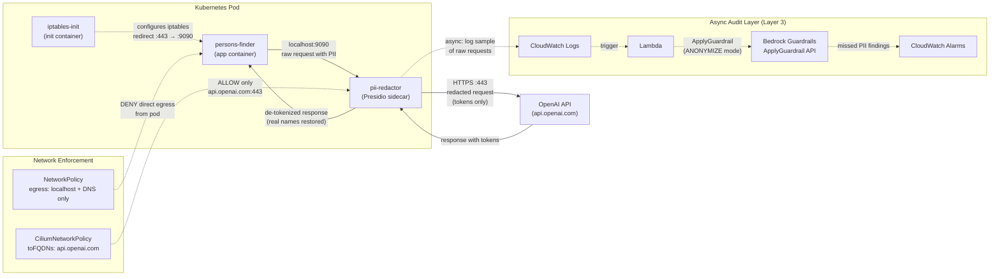

# PII Redaction Architecture — Persons Finder

## 1. Problem Statement

The Persons Finder app sends user PII to OpenAI's API for LLM-powered features. The `Person` data class contains `id` and `name` fields, and the application is designed to handle bios and location data. Every API call to `api.openai.com` transmits this PII outside our cluster boundary — across the public internet to a third-party provider.

This is a data egress problem: **real names and personal data must not leave our cluster unprotected.**

## 2. Threat Model

```
┌─────────────────────────────────────────────────────────┐
│ What PII exists?                                        │
│   • Person.name (String) — full names                   │
│   • Bios / free-text descriptions                       │
│   • Location data (lat/lng, addresses)                  │
│   • Contextual PII in user queries (emails, phones)     │
├─────────────────────────────────────────────────────────┤
│ Where does it flow?                                     │
│   Pod (persons-finder) → HTTPS :443 → api.openai.com   │
├─────────────────────────────────────────────────────────┤
│ What are the risks?                                     │
│   T1: PII stored in OpenAI training data / logs         │
│   T2: PII intercepted in transit (mitigated by TLS)     │
│   T3: PII exposed via OpenAI data breach                │
│   T4: Regulatory violation (GDPR, CCPA, NZPA)          │
│   T5: App container bypasses redaction (direct egress)  │
└─────────────────────────────────────────────────────────┘
```

## 3. Compliance Context

| Regulation | Relevant Requirement | Impact |
|---|---|---|
| **GDPR Art. 5(1)(c)** | Data minimization — only process data adequate and relevant for the purpose | Sending full names to an LLM when only a placeholder is needed violates minimization |
| **GDPR Art. 44–49** | Restrictions on international data transfers | OpenAI processes data in the US; transferring EU PII requires SCCs or adequacy decisions |
| **CCPA §1798.100** | Right to know what personal information is collected and disclosed to third parties | Users must be informed if their names are sent to OpenAI |
| **NZ Privacy Act 2020, IPP 11** | Limits on disclosure of personal information | Sending PII to a foreign LLM provider requires justification |

The safest architectural position: **never send real PII in the first place.** Replace it with reversible tokens before it leaves the cluster, and restore the original values when the response returns.

---

## 4. Solution Overview: Hybrid Defense-in-Depth

We use a three-layer defense-in-depth architecture:

1. **Layer 1 — Presidio Sidecar (hot path):** An in-cluster sidecar container running Microsoft Presidio intercepts all outbound LLM traffic, detects PII via regex + NER, replaces it with reversible tokens, and restores original values in the response. PII never leaves the pod.

2. **Layer 2 — Network Enforcement:** Kubernetes NetworkPolicy restricts pod egress to DNS + HTTPS only. An iptables init container transparently redirects the app's outbound :443 traffic to the sidecar's proxy port, making bypass impossible. Cilium FQDN-based egress policy (if available) further restricts destinations to `api.openai.com` only.

3. **Layer 3 — Bedrock Guardrails Audit (async):** A sample of pre-redaction request bodies are logged to CloudWatch. A Lambda function calls the Bedrock Guardrails `ApplyGuardrail` API to detect any PII the sidecar missed. Findings trigger CloudWatch alarms for compliance alerting.



---

## 5. Layer 1: Presidio PII Redaction Sidecar

### Why Presidio?

[Microsoft Presidio](https://github.com/microsoft/presidio) is an open-source framework for PII detection and anonymization. It combines multiple detection strategies in a single pipeline:

- **Regex recognizers** — structured PII: emails, phone numbers, SSNs, credit cards, IP addresses (deterministic, fast)
- **spaCy NER model** (`en_core_web_lg`) — unstructured PII: person names, locations, organizations (ML-based, contextual)
- **Custom recognizers** — domain-specific patterns (e.g., internal employee IDs)
- **Checksum validators** — credit card Luhn checks, SSN format validation (reduces false positives)

Presidio's Anonymizer engine supports **reversible operations** via an encrypt/decrypt operator using AES-CBC, meaning we can tokenize PII on the way out and restore it on the way back.

### Request Flow (Outbound)

```
App → localhost:9090 → Presidio Sidecar → api.openai.com
```

1. App sends LLM request to `localhost:9090` (the sidecar's proxy port).
2. Sidecar extracts the request body (the prompt containing PII).
3. **Presidio Analyzer** scans the text:
   - Regex recognizers fire first (fast, deterministic) — catches emails, phones, SSNs, credit cards.
   - spaCy NER model runs second — catches person names, locations, organizations.
   - Results are merged and deduplicated by span position.
4. **Presidio Anonymizer** replaces each detected entity with an AES-encrypted token:
   - `John Smith` → `<PERSON_aG9obiBTbWl0aA==>`
   - `john@example.com` → `<EMAIL_am9obkBleGFtcGxlLmNvbQ==>`
5. Token-to-entity mapping is stored in an in-memory map (per-request, short-lived).
6. Redacted request is forwarded to `api.openai.com` over HTTPS.

### Response Flow (Inbound)

```
api.openai.com → Presidio Sidecar → App
```

1. LLM response arrives at the sidecar.
2. **Presidio Deanonymizer** scans for encrypted tokens and decrypts them back to original values using the per-request key.
3. De-tokenized response is returned to the app on localhost.

### Sidecar Proxy Logic (Presidio Python)

```python
from presidio_analyzer import AnalyzerEngine
from presidio_anonymizer import AnonymizerEngine, DeanonymizeEngine
from presidio_anonymizer.entities import OperatorConfig

# Initialize engines (once at startup)
analyzer = AnalyzerEngine()  # loads spaCy + regex recognizers
anonymizer = AnonymizerEngine()
deanonymizer = DeanonymizeEngine()

AES_KEY = os.environ["PRESIDIO_AES_KEY"]  # 128/256-bit key from K8s Secret

def redact_request(text: str) -> tuple[str, dict]:
    """Analyze text for PII and return (redacted_text, operator_results)."""
    results = analyzer.analyze(text=text, language="en")
    anonymized = anonymizer.anonymize(
        text=text,
        analyzer_results=results,
        operators={
            "DEFAULT": OperatorConfig("encrypt", {"key": AES_KEY}),
        },
    )
    return anonymized.text, anonymized.items

def restore_response(text: str, items: list) -> str:
    """Decrypt tokens in LLM response back to original values."""
    return deanonymizer.deanonymize(
        text=text,
        entities=items,
        operators={"DEFAULT": OperatorConfig("decrypt", {"key": AES_KEY})},
    ).text
```

### Sidecar Container Spec

```yaml
initContainers:
  # Redirect outbound :443 traffic to sidecar :9090 (Istio-style)
  - name: iptables-init
    image: istio/proxyv2:1.20.0
    securityContext:
      capabilities:
        add: ["NET_ADMIN"]
      runAsNonRoot: false
      runAsUser: 0
    command:
      - iptables
      - -t nat
      - -A OUTPUT
      - -p tcp
      - --dport 443
      - -m owner
      - '!' --uid-owner 1337   # exclude sidecar's own traffic
      - -j REDIRECT
      - --to-port 9090

containers:
  # ... existing persons-finder container (unchanged) ...

  - name: pii-redactor
    image: 637423556985.dkr.ecr.us-east-1.amazonaws.com/pii-redactor:latest
    ports:
      - containerPort: 9090
        protocol: TCP
    env:
      - name: UPSTREAM_URL
        value: "https://api.openai.com"
      - name: PRESIDIO_AES_KEY
        valueFrom:
          secretKeyRef:
            name: presidio-secret
            key: AES_KEY
      - name: LOG_REDACTED
        value: "true"
      - name: AUDIT_SAMPLE_RATE
        value: "0.1"  # log 10% of raw requests for Layer 3 audit
    securityContext:
      runAsUser: 1337          # matches iptables exclusion UID
      runAsNonRoot: true
      readOnlyRootFilesystem: true
      allowPrivilegeEscalation: false
      capabilities:
        drop: ["ALL"]
    resources:
      requests:
        memory: "256Mi"        # spaCy en_core_web_lg model ~100MB
        cpu: "200m"
      limits:
        memory: "512Mi"
        cpu: "500m"
    readinessProbe:
      httpGet:
        path: /healthz
        port: 9090
      periodSeconds: 5
    livenessProbe:
      httpGet:
        path: /healthz
        port: 9090
      periodSeconds: 10
```

### What Gets Redacted — Example

**Before (raw request leaving app container):**
```json
{
  "model": "gpt-4",
  "messages": [{
    "role": "user",
    "content": "Find people near John Smith in Auckland. His email is john@example.com and phone is 021-555-0123."
  }]
}
```

**After (what actually reaches api.openai.com):**
```json
{
  "model": "gpt-4",
  "messages": [{
    "role": "user",
    "content": "Find people near <PERSON_aG9obiBTbWl0aA==> in <LOCATION_QXVja2xhbmQ=>. His email is <EMAIL_am9obkBleGFtcGxlLmNvbQ==> and phone is <PHONE_MDIxLTU1NS0wMTIz>."
  }]
}
```

---

## 6. Layer 2: Network Enforcement

The sidecar is only effective if the app container **cannot bypass it**. We enforce this at three levels.

### 6a. Kubernetes NetworkPolicy

Standard K8s NetworkPolicy operates at the pod level (not per-container), so we restrict the entire pod's egress and rely on the iptables init container to route app traffic through the sidecar.

```yaml
apiVersion: networking.k8s.io/v1
kind: NetworkPolicy
metadata:
  name: persons-finder-egress
  namespace: persons-finder
spec:
  podSelector:
    matchLabels:
      app: persons-finder
  policyTypes:
    - Egress
  egress:
    # DNS — restricted to CoreDNS pods only (prevents DNS tunneling exfiltration)
    - to:
        - namespaceSelector:
            matchLabels:
              kubernetes.io/metadata.name: kube-system
          podSelector:
            matchLabels:
              k8s-app: kube-dns
      ports:
        - port: 53
          protocol: UDP
        - port: 53
          protocol: TCP
    # HTTPS outbound (only the sidecar will use this, enforced by iptables)
    - ports:
        - port: 443
          protocol: TCP
    # Localhost communication (app ↔ sidecar)
    - to:
        - ipBlock:
            cidr: 127.0.0.0/8
      ports:
        - port: 9090
          protocol: TCP
```

### 6b. iptables Init Container (Transparent Interception)

The init container configures iptables NAT rules before any application container starts. This is the same pattern used by Istio and Linkerd for transparent traffic interception:

```
iptables -t nat -A OUTPUT -p tcp --dport 443 \
  -m owner ! --uid-owner 1337 \
  -j REDIRECT --to-port 9090
```

How it works:
- All outbound TCP traffic to port 443 from the app container (UID 1000) is redirected to the sidecar's port 9090.
- The sidecar itself runs as UID 1337, so its own outbound traffic to `api.openai.com:443` is **not** redirected (avoids infinite loop).
- The app container doesn't need any code changes — it can still target `https://api.openai.com` directly, and the traffic is transparently intercepted.

### 6c. Cilium FQDN-Based Egress Policy (Defense in Depth)

If the cluster uses Cilium as its CNI, we can add a Layer 7 FQDN-based egress policy that restricts which domains the pod can reach. This is stronger than IP-based policies because OpenAI's IPs can change.

```yaml
apiVersion: cilium.io/v2
kind: CiliumNetworkPolicy
metadata:
  name: persons-finder-fqdn-egress
  namespace: persons-finder
spec:
  endpointSelector:
    matchLabels:
      app: persons-finder
  egress:
    # Allow DNS for FQDN resolution
    - toEndpoints:
        - matchLabels:
            k8s:io.kubernetes.pod.namespace: kube-system
            k8s-app: kube-dns
      toPorts:
        - ports:
            - port: "53"
              protocol: ANY
          rules:
            dns:
              - matchPattern: "*.openai.com"
              - matchPattern: "*.amazonaws.com"
    # Allow HTTPS only to OpenAI and AWS APIs
    - toFQDNs:
        - matchName: "api.openai.com"
        - matchPattern: "*.bedrock-runtime.*.amazonaws.com"
        - matchPattern: "*.logs.*.amazonaws.com"
      toPorts:
        - ports:
            - port: "443"
              protocol: TCP
```

This ensures that even if the iptables rules are somehow bypassed, the pod can only reach `api.openai.com` and AWS service endpoints — nothing else.

---

## 7. Layer 3: Async Bedrock Guardrails Audit

The sidecar handles the hot path, but no PII detection system is perfect. Presidio's spaCy NER model may miss contextual PII (e.g., "the CEO of Acme Corp" where "Acme Corp" implies a specific person). The async audit layer catches these gaps.

### How It Works

```
Sidecar → CloudWatch Logs → Lambda (trigger) → ApplyGuardrail → CloudWatch Alarms
```

1. The sidecar logs a **sample** (configurable, default 10%) of raw pre-redaction request bodies to CloudWatch Logs. The raw text is logged to a dedicated, encrypted log group with a short retention period (7 days).
2. A CloudWatch Logs subscription filter triggers a Lambda function.
3. The Lambda calls Bedrock Guardrails `ApplyGuardrail` API with the raw text.
4. If Bedrock detects PII that the sidecar missed, the finding is published to a CloudWatch custom metric.
5. A CloudWatch Alarm fires if the missed-PII rate exceeds a threshold (e.g., >5% of sampled requests).

### ApplyGuardrail API Call

```python
import boto3

bedrock = boto3.client("bedrock-runtime", region_name="us-east-1")

response = bedrock.apply_guardrail(
    guardrailIdentifier="persons-finder-pii-audit",
    guardrailVersion="DRAFT",
    source="INPUT",
    content=[{"text": {"text": raw_request_body}}],
)

# response["action"] == "NONE" → no PII found (sidecar caught everything)
# response["action"] == "ANONYMIZED" → PII found that sidecar missed
if response["action"] == "ANONYMIZED":
    missed_entities = []
    for assessment in response.get("assessments", []):
        pii = assessment.get("sensitiveInformationPolicy", {}).get("piiEntities", [])
        missed_entities.extend(pii)
    # Publish metric: missed PII count
    cloudwatch.put_metric_data(
        Namespace="PersonsFinder/PIIAudit",
        MetricData=[{
            "MetricName": "MissedPIIEntities",
            "Value": len(missed_entities),
            "Unit": "Count",
        }],
    )
```

### Why Async, Not Inline?

- **Latency:** `ApplyGuardrail` adds ~30-80ms per call. The LLM call itself takes 500ms+, so this would add 6-16% overhead on the hot path. Unacceptable for a secondary check.
- **Cost:** At $0.75 per 1K text units, running every request through Bedrock Guardrails adds up. Sampling at 10% reduces cost by 90%.
- **Irony:** Sending raw PII to an AWS API to detect PII means PII still leaves the pod. The sidecar handles the primary redaction; Bedrock is the safety net, not the first line of defense.

---

## 8. Alternatives Considered

| Approach | Latency | PII Leaves Pod? | Reversible? | Cost | Verdict |
|---|---|---|---|---|---|
| **Presidio sidecar** (chosen — Layer 1) | ~5-10ms | ❌ No — in-cluster NER | ✅ AES encrypt/decrypt | Open source, ~256Mi memory | ✅ Primary approach |
| **Bedrock Guardrails `ApplyGuardrail`** (chosen — Layer 3) | ~30-80ms | ⚠️ Yes — AWS API call | ✅ With tokenization service | $0.75/1K text units | ✅ Async audit layer |
| **Amazon Comprehend `DetectPiiEntities`** | ~50-100ms | ⚠️ Yes — AWS API call | ❌ Detection only, no anonymization | ~$0.0001/100 chars | ⚠️ Viable but older, less integrated |
| **Amazon Macie** | N/A — batch only | N/A | ❌ | Per-bucket pricing | ❌ **Wrong tool.** S3-only, scans objects at rest. No API for inline text scanning. Cannot intercept HTTP request bodies. |
| **NVIDIA NeMo Guardrails** | ~10-50ms | ❌ Self-hosted | ❌ Detection + blocking only | Open source, needs GPU (T4+) | ⚠️ Overkill — designed for dialog management, not just PII |
| **Portkey / LiteLLM Gateway** | ~5-15ms (proxy hop) | ⚠️ Yes — SaaS dependency | Depends on provider | SaaS pricing | ⚠️ Adds external SaaS to security-critical path |
| **LeakSignal (Proxy-WASM)** | ~1-3ms | ❌ In-mesh | ❌ Detection only, no redaction | Open source | ⚠️ Detection/alerting only — doesn't redact or tokenize |
| **Envoy ext_proc / WASM filter** | ~2-5ms | ❌ In-proxy | Possible with custom code | Open source, complex dev | ⚠️ High performance but significant development effort |
| **Application-level middleware** | ~1-2ms | ❌ In-process | ✅ Custom implementation | Dev time only | ⚠️ Requires code changes, language-specific, easy to bypass |

### Why Not Macie?

Amazon Macie is a **data-at-rest discovery service** for S3 buckets. It:
- Only scans objects stored in S3 using scheduled or on-demand jobs
- Has no synchronous API for scanning arbitrary text
- Cannot intercept HTTP request/response bodies
- Is designed for compliance auditing of stored data, not real-time traffic filtering

Using Macie for this problem would be like using a fire alarm to prevent fires — it can tell you after the fact that PII was stored somewhere, but it cannot prevent PII from leaving the cluster in real time.

### Why Presidio Over Comprehend/Bedrock as Primary?

The fundamental tension: **to detect PII with a cloud API, you must first send the PII to that cloud API.** This is acceptable for an audit layer (Layer 3) but not for the primary defense (Layer 1).

Presidio runs entirely in-cluster. The PII never leaves the pod boundary, even for detection. This is the strongest privacy guarantee and the most defensible position for compliance.

---

## 9. Audit & Compliance

### Redaction Audit Log Format

The sidecar logs every redaction event (original values are **never** logged — only hashes):

```json
{
  "timestamp": "2026-02-24T09:51:00Z",
  "request_id": "req_abc123",
  "entities_redacted": [
    {"type": "PERSON", "original_sha256": "a1b2c3...", "position": [28, 38]},
    {"type": "EMAIL", "original_sha256": "d4e5f6...", "position": [55, 71]},
    {"type": "LOCATION", "original_sha256": "g7h8i9...", "position": [42, 50]}
  ],
  "total_entities": 3,
  "analyzer_time_ms": 4.2,
  "anonymizer_time_ms": 0.8
}
```

### Log Shipping

- Sidecar writes structured JSON logs to stdout.
- Fluent Bit (DaemonSet) ships logs to CloudWatch Logs.
- Redaction audit logs go to a dedicated log group: `/persons-finder/pii-redaction-audit`.
- Raw pre-redaction samples (Layer 3) go to an encrypted log group with 7-day retention: `/persons-finder/pii-audit-raw` (KMS-encrypted, restricted IAM access).

### Compliance Mapping

| Control | Implementation |
|---|---|
| **Data minimization** (GDPR Art. 5) | Presidio sidecar strips PII before egress — only tokens leave the cluster |
| **Transfer safeguards** (GDPR Art. 44) | Real PII never reaches OpenAI's US-based servers |
| **Audit trail** (SOC 2 CC7.2) | Every redaction event is logged with entity type, hash, and timestamp |
| **Monitoring & alerting** (SOC 2 CC7.3) | Bedrock Guardrails audit layer detects missed PII; CloudWatch alarms notify on threshold breach |
| **Encryption at rest** (SOC 2 CC6.1) | Audit logs encrypted via KMS; AES key for tokenization stored in Secrets Manager |
| **Least privilege** (SOC 2 CC6.3) | Sidecar runs as non-root (UID 1337), read-only filesystem, all capabilities dropped |

### Redaction Rules as ConfigMap

Redaction patterns are configurable without redeployment:

```yaml
apiVersion: v1
kind: ConfigMap
metadata:
  name: pii-redactor-config
  namespace: persons-finder
data:
  config.yaml: |
    recognizers:
      - name: NZ_PHONE
        type: PHONE_NUMBER
        patterns:
          - regex: '\b0[2-9]\d{1}-?\d{3}-?\d{4}\b'
            score: 0.7
      - name: NZ_IRD
        type: NZ_TAX_ID
        patterns:
          - regex: '\b\d{2}-?\d{3}-?\d{3}\b'
            score: 0.6
    thresholds:
      min_score: 0.5
    audit:
      sample_rate: 0.1
      log_group: /persons-finder/pii-audit-raw
```

---

## 10. Trade-offs

| Dimension | Value | Notes |
|---|---|---|
| **Sidecar latency** | ~5-10ms per request | Negligible vs 500ms+ LLM call. spaCy NER is the bottleneck; regex is <1ms. |
| **Memory overhead** | ~256Mi (request), ~512Mi (limit) | spaCy `en_core_web_lg` model is ~100MB. Lighter models (`en_core_web_sm`) use ~30MB but have lower accuracy for names. |
| **Accuracy (structured PII)** | ~99%+ | Regex + checksum validation for emails, phones, SSNs, credit cards. Very few false negatives. |
| **Accuracy (names/locations)** | ~85-92% | spaCy NER depends on context. "John" in "Dear John" is caught; "Jordan" (name vs country) may be ambiguous. The Bedrock audit layer catches what NER misses. |
| **Reversibility** | ✅ Full | AES-CBC encryption is deterministic with the same key. Tokens can be decrypted in the response flow. |
| **Failure mode** | Fail-closed | If the sidecar crashes, the iptables rules still redirect traffic to port 9090 — requests fail rather than bypassing redaction. This is the safe default. |
| **Cold start** | ~2-3s | spaCy model loading. Mitigated by readiness probe — pod isn't marked ready until the model is loaded. |
| **Audit layer cost** | ~$0.075/1K requests | At 10% sampling rate and $0.75/1K text units for Bedrock Guardrails. |

---

## 11. Future Evolution

1. **Fine-tuned NER model:** Replace spaCy's generic `en_core_web_lg` with a model fine-tuned on our domain (person names, NZ-specific locations). NVIDIA research shows fine-tuned models outperform Presidio's defaults by ~26% on core PII categories.

2. **Bedrock Guardrails + tokenization (inline):** As latency improves, move Bedrock Guardrails from async audit to inline processing using the `ApplyGuardrail` + tokenization pattern (format-preserving tokens via AWS KMS or a dedicated tokenization service). This would give us a fully managed, reversible redaction pipeline.

3. **GLiNER zero-shot NER:** Replace spaCy with [GLiNER](https://huggingface.co/knowledgator/gliner-pii-base-v1.0), a bidirectional transformer that can identify arbitrary entity types at runtime without retraining. Better accuracy for edge cases like contextual PII.

4. **Istio/Linkerd integration:** If the cluster adopts a service mesh, replace the custom iptables init container with mesh-native traffic interception. The sidecar becomes a WASM filter in the Envoy proxy, eliminating the need for a separate container.

5. **Multi-language support:** Presidio supports multiple spaCy language models. As the app expands to non-English markets, add language-specific recognizers via the ConfigMap.
