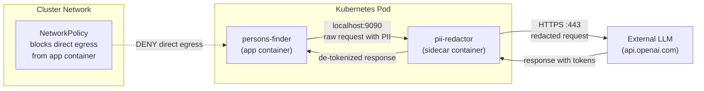

# PII Redaction Architecture — Persons Finder

## Problem

The Persons Finder app sends user PII (names, bios, locations) to an external LLM provider (OpenAI). Real names and personal data must not leave our cluster boundary unprotected.

## Solution: PII Redaction Sidecar

A sidecar container intercepts all outbound HTTP traffic to the LLM API, detects PII, replaces it with reversible tokens, and restores real values in the response.

## Architecture Diagram



## How It Works

### 1. Request Flow (Outbound)

```
App → localhost:9090 → PII Redactor Sidecar → api.openai.com
```

1. App sends LLM requests to `localhost:9090` (sidecar) instead of directly to OpenAI.
2. Sidecar parses the request body and runs PII detection:
   - **Regex patterns**: emails, phone numbers, SSNs, credit cards
   - **NER model** (e.g., spaCy `en_core_web_sm`): person names, locations, organizations
3. Detected PII is replaced with deterministic tokens: `John Smith` → `[PERSON_a1b2c3]`
4. Token-to-real-value mapping is stored in an in-memory map (per-request, short-lived).
5. Redacted request is forwarded to the real LLM endpoint over HTTPS.

### 2. Response Flow (Inbound)

```
api.openai.com → PII Redactor Sidecar → App
```

1. LLM response arrives at the sidecar.
2. Sidecar scans for tokens (`[PERSON_a1b2c3]`) and replaces them with original values.
3. De-tokenized response is returned to the app on localhost.

### 3. Network Enforcement

```yaml
# NetworkPolicy ensures the app container CANNOT reach external IPs directly.
# Only the sidecar container is allowed egress to port 443.
spec:
  podSelector:
    matchLabels:
      app.kubernetes.io/name: persons-finder
  egress:
    - to:
        - ipBlock:
            cidr: 127.0.0.0/8  # localhost only for app
      ports:
        - port: 9090
```

The sidecar has a separate network policy allowing egress to `api.openai.com:443`.

## Sidecar Container Spec

```yaml
- name: pii-redactor
  image: 637423556985.dkr.ecr.us-east-1.amazonaws.com/pii-redactor:latest
  ports:
    - containerPort: 9090
  env:
    - name: UPSTREAM_URL
      value: "https://api.openai.com"
    - name: REDACTION_MODE
      value: "tokenize"  # or "mask" for non-reversible
    - name: LOG_REDACTED
      value: "true"       # audit log of what was redacted
  resources:
    requests:
      memory: "128Mi"
      cpu: "100m"
    limits:
      memory: "256Mi"
      cpu: "200m"
  securityContext:
    runAsNonRoot: true
    readOnlyRootFilesystem: true
    allowPrivilegeEscalation: false
    capabilities:
      drop: ["ALL"]
```

## Alternatives Considered

| Approach | Pros | Cons |
|----------|------|------|
| **Sidecar proxy** (chosen) | No app code changes, per-pod isolation, simple deployment | Adds latency (~5-10ms), NER model uses memory |
| **Envoy filter (WASM)** | High performance, integrates with service mesh | Complex to develop, limited language support for WASM |
| **Istio WASM plugin** | Centralized policy, mesh-wide | Heavy dependency (Istio), overkill for single service |
| **Dedicated API gateway** | Centralized, reusable across services | Single point of failure, network hop, harder to enforce per-pod |
| **Application-level middleware** | Lowest latency | Requires code changes, language-specific, easy to bypass |

## Trade-offs

- **Latency**: NER adds ~5-10ms per request. Acceptable for LLM calls (which take 500ms+).
- **Accuracy**: Regex catches structured PII (emails, phones). NER catches names but may have false positives/negatives. A tuned model or allowlist improves accuracy.
- **Reversibility**: Tokenization allows the app to receive meaningful responses. If reversibility isn't needed, simple masking (`***`) is simpler and more secure.
- **Memory**: spaCy NER model uses ~100MB. Lightweight alternatives (Presidio, regex-only) use less.

## Audit & Compliance

- Sidecar logs every redaction event: `{timestamp, field, original_hash, token}` (original value is hashed, not logged).
- Logs ship to CloudWatch via Fluent Bit for SOC2/GDPR audit trail.
- Redaction rules are configurable via ConfigMap — no redeployment needed to update patterns.
